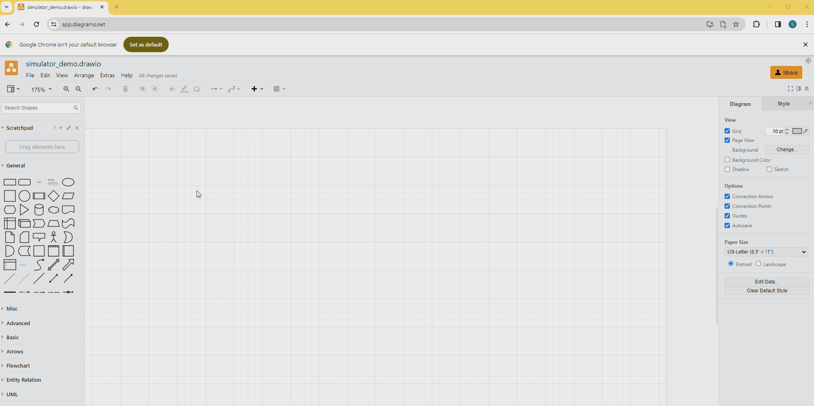
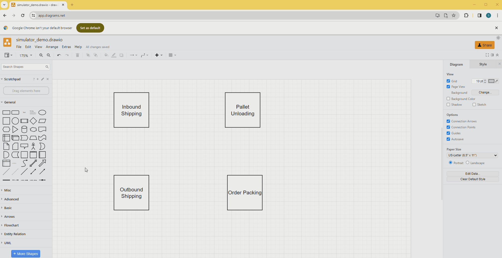
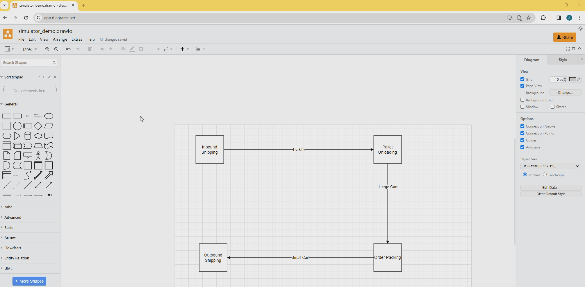
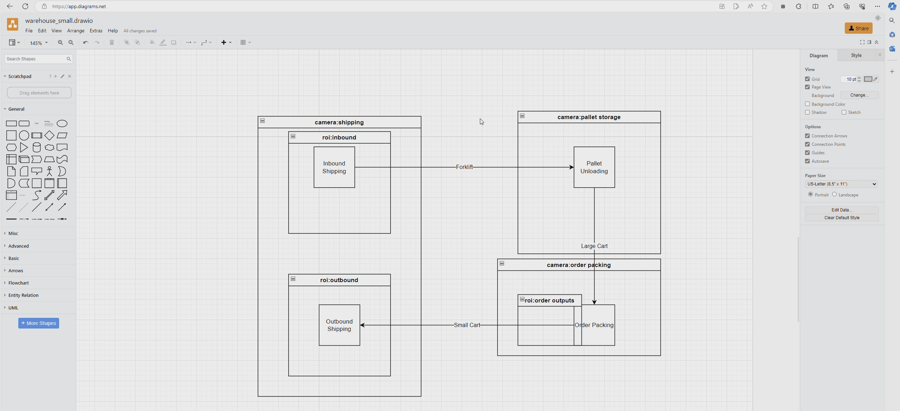
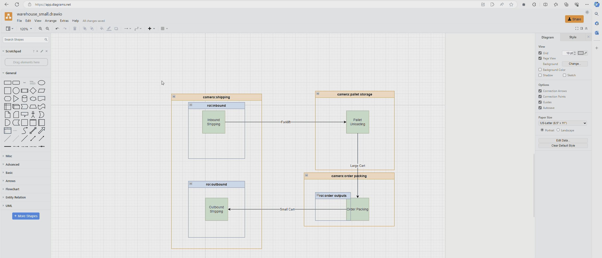
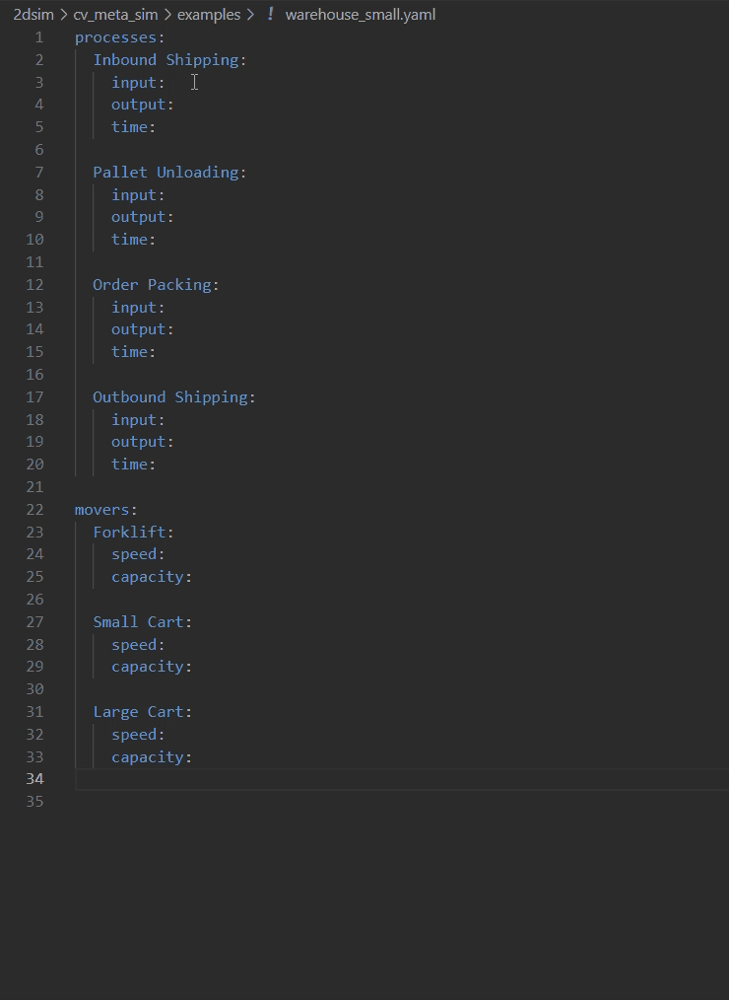
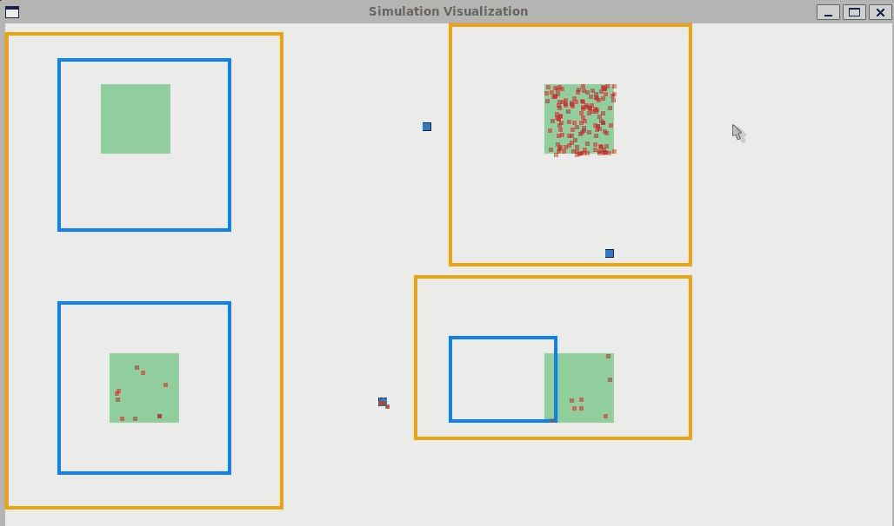
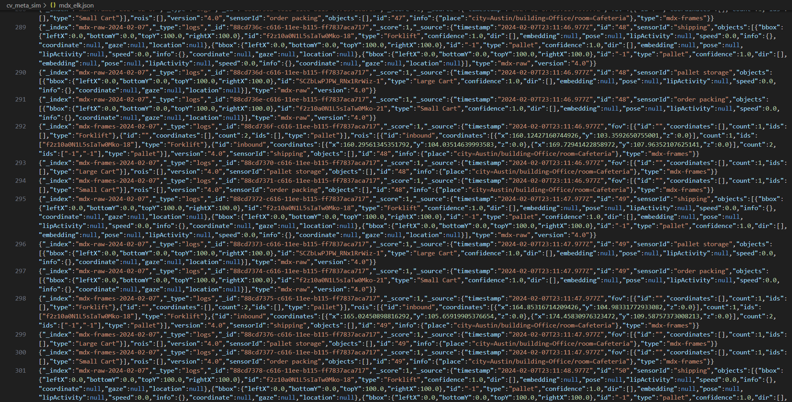
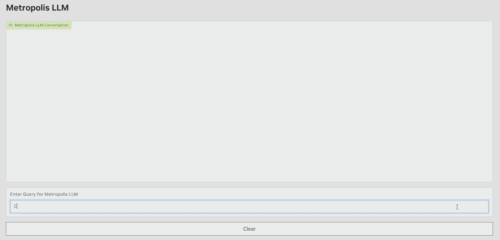

# Metropolis Object Detection Simulator

This project is a simulator that allows you to generate synthetic MDX compatible data based on your own custom warehouse or factory workflow. 

This simulator allows you to:
- Define a warehouse or factory workflow with camera regions in [draw.io](https://app.diagrams.net/)
- Configure production values and object movement is a simpe yaml file
- Generate hours of synthetic detection metadata in minutes
- Load the MDX compatible metadata into Elastic Search 
- Query the synthetic data through the MDX APIs or with the Metropolis LLM for API workflow 

# Quick Start 

```
git clone https://github.com/NVIDIA-AI-IOT/metro_cv_sim
cd metro_cv_sim
python3 -m pip install -r requirements.txt
```

Sample diagrams and yaml configurations are provided in the examples folder. 

To quickly generate data based off these examples, run 

```
python3 main.py -d exampes/warehouse_small.drawio -y examples/warehouse_small.yaml -t 60 -v -a
```

This will use the small warehouse diagram and yaml configuration, run the simulatin for 60 simulated minutes, enable the visualizer and the anlytics module for metadata output. 

```
python3 main.py -d examples/warehouse_large.drawio -y examples/warehouse_large.yaml -t 180 -a
```

This will use the large warehouse diagram and yaml configuration, run the simulation for 180 simulated minutes, and enable the anlytics module for metadata output. 


## Create DrawIO Diagram 

The simulation script is built to model a 2D pipeline that represents a warehouse or factory workflow. A pipeline is defined by a set of processes and movers. Processes accept items as input and produces new items as output. Items are transported between processes by movers. Cameras and regions of interest (ROI) can be added to track object detections (items and movers) in desired regions. Use [draw.io](https://app.diagrams.net/) to quickly model your pipeline to be used as input to the simulation. 

### Step 1: Create Processes

Use the "Square" component, drag it into your diagram and give it a label. Each labelled square will represent one process in your pipeline. A process can be a producer, consumer or both. 




### Step 2: Create Movers

Each process must have atleast one arrow connection to another process. The arrows connecting processes each represent a mover. A mover is a object that will transport items between processes. Each mover must be given a label such as a forklift, cart, person etc. 



A process can take the following forms 

inputs = 0, outputs = 1 (producer)
inputs >= 1, outputs = 0 (consumer)
inputs >= 1, outputs = 1 (producer & consumer)

This means that a process can only have 1 output connection but can accept multiple input connections. 

A producer will generate new items without any input items.
A consumer will delete items input items and produce no new items. 

### Step 3: Create Cameras and ROIs

During simulation, movers will carry items between processes. To track the movement of movers and items, you can define cameras and regions of interest. When movers or items enter a camera or region of interest, this detection will be logged in an MDX compatible format. 

To setup cameras and regions of interest use the "Vertical Container" component to encompass the area you want to detect objects in. 

Cameras and ROIs must be labelled and follow this format:

- camera:X
- roi:X

Where X is the name of the camera or region of interest. 




### Step 4: Misc

To organize your diagram you can add colors to each component. 



For best results in the simulation visualization, select all components in the diagram and align it to the top left corner of a page. 



## Create YAML Configuration

Save the drawio diagram to your device as a .xml or .drawio file. 

Run the main script 

```
python3 main.py -d path/to/diagram.drawio
```

This will output a template yaml file that you must fill in to configure the processes and movers. 

For each process, you must specify the input items, output items and the processing time. 
For each mover, you must specify the capacity and speed of the mover. 

View the yaml files in the example folder for a reference. 



## Run Simulation
With the diagram and yaml complete. You can run the full simulation to produce synthetic detection data. 

```
python3 main.py -d path/to/diagram.drawio -y path/to/diagram.yaml -t 60 -v -a 
```

The -t argument specifies the amount of simulated time in minutes to generate data for
The -v flag enables the visualizer (display a window with a view of the live simulation)
The -a flag enables the analytic module (generates the metadata file as the simulation is running)




## Synthetic Data Output

If the -a flag was used when running the simulation, then a file named ```mdx_elk.json``` will be produced. This file contains all the detection data that can be loaded into elastic search to use with the MDX web APIs (not in this repo). 




Once the data is loaded into elastic search and the MDX web APIs are running, you can deploy the LLM4APIs workflow (not in this repo) with MDX to query the data in natural language. 




